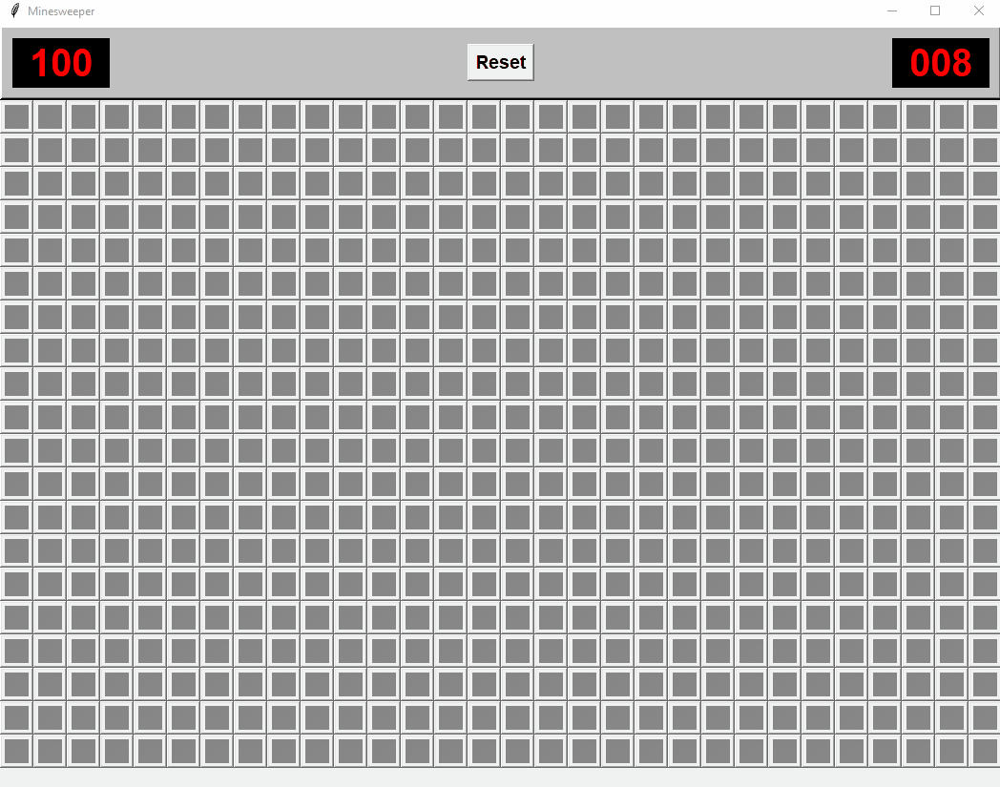

# Minesweeper - Python & Tkinter

A classic Minesweeper clone built with Python to practice graph traversal and algorithmic problem-solving.

<p align="center">
  
</p>

## Key Features

* ** Customizable Safe Start:** The first click is never a mine. The algorithm ensures a safe area around the initial click to get the game moving. This is easily adjustable in the code for a more harder start.
* ** Chording Mechanic:** Implemented advanced fast-clearing. If you have flagged the correct number of mines around a number, clicking that number will automatically reveal all remaining adjacent tiles.
* ** Stack-based DFS Discovery:** I used a stack-based DFS for cascading empty tile reveals.

## Requirements & Running

No external libraries are required.

### How to run:
1. Clone the repository.
2. Open your terminal in the root directory.
3. Run the following command:
```bash
python src/minesweeper.py